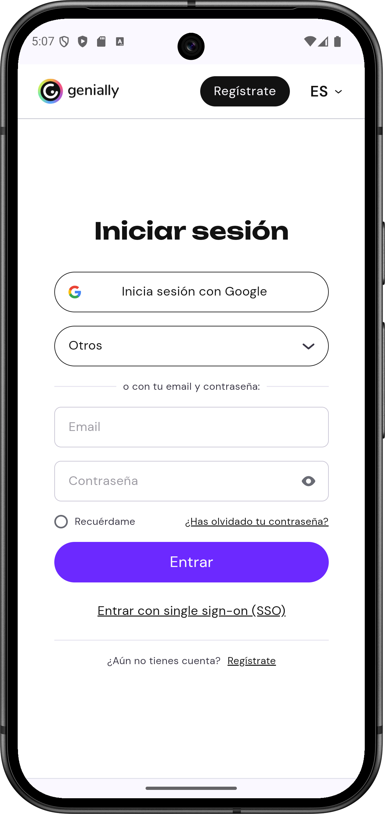
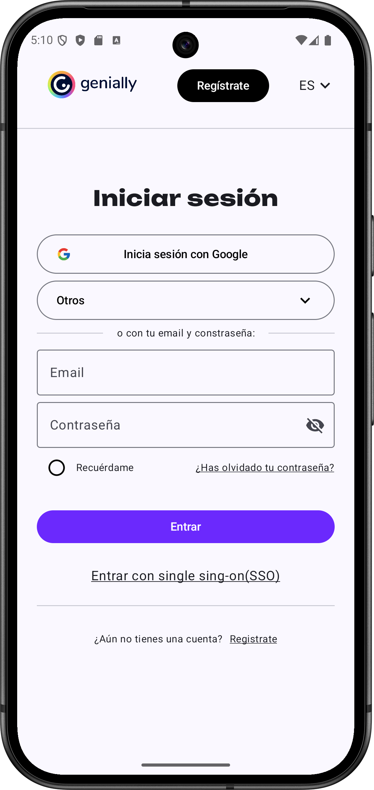

# Inicio de sesión de Genially

## Inicio de sesion original

<figure><figcaption></figcaption></figure>

## Mi replica

<figure><figcaption></figcaption></figure>

Enlaces a Página:


[funcionalidad.md](funcionalidad.md)



[menu-idiomas.md](menu-idiomas.md)



[dialogo-de-inicio-de-sesin-3ta.md](dialogo-de-inicio-de-sesin-3ta.md)


