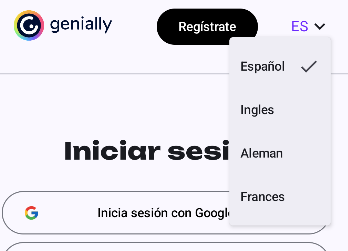

# Menu Idiomas

En la TopBar he decidio hacer de manera "funcinal" la seleccion del idioma

<figure><figcaption></figcaption></figure>

Se cambia el color del texto y si cambias el idioma se cambia también

<figure><figcaption></figcaption></figure>

<figure><figcaption></figcaption></figure>
